Keyes brick 24合一传感器套装

# 产品介绍

Keyes brick 24合一传感器套装主要包含了我们常用的24款传感器/模块，还有对应的keyes UNO PLUS开发板、传感器扩展板和连接线。24款传感器/模块上都带有防反接口，和我们提供的传感器扩展板接口完全匹配。使用时，我们只需要将传感器扩展板堆叠在keyes UNO PLUS开发板，利用1根自带的连接线将传感器/模块连接在扩展板上，简单方便。

为了让你对这个24款传感器/模块有更深入的了解，我们还基于这个24款传感器/模块做个多个学习课程。这些课程是利用米思齐软件平台制作的，课程中我们提供了对应的接线方法、图形化编程代码、实验结果和简单的代码介绍等信息。通过这些课程，可以让我们对编程方法、逻辑有了更深刻的理解。

# 清单

|编码|名称|规格型号|数量|图片|
|-|-|-|-|-|
|1|Keyes模块|keyes brick LED红发红模块(焊盘孔) 防反插白色端子|1||
|2|Keyes模块|keyes brick 插件RGB模块(焊盘孔) 防反插白色端子|1||
|3|Keyes传感器|keyes brick 热敏电阻传感器(焊盘孔) 防反插白色端子|1||
|4|Keyes模块|keyes brick 无源蜂鸣器模块(焊盘孔) 防反插白色端子|1|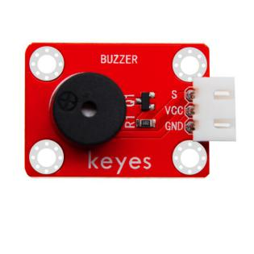|
|5|keyes传感器|keyes brick 霍尔传感器(焊盘孔) 防反插白色端子|1||
|6|Keyes传感器|keyes brick 敲击模块传感器(焊盘孔) 防反插白色端子|1||
|7|Keyes模块|keyes brick 旋转编码器模块(焊盘孔) 防反插白色端子|1||
|8|keyes传感器|keyes brick 18B20温度传感器(焊盘孔) 防反插白色端子|1||
|9|Keyes模块|keyes brick LED黄发黄模块(焊盘孔) 防反插白色端子|1|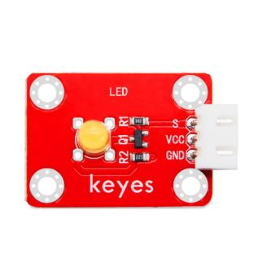|
|10|Keyes传感器|keyes brick 光敏电阻传感器(焊盘孔) 防反插白色端子|1||
|11|Keyes模块|keyes brick 可调电位器模块(焊盘孔) 防反插白色端子|1||
|12|Keyes传感器|keyes brick 避障传感器(焊盘孔) 防反插白色端子|1|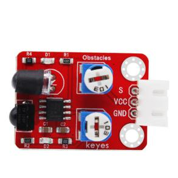|
|13|Keyes传感器|keyes brick 按键传感器(焊盘孔) 防反插白色端子（配黄帽）|1||
|14|Keyes模块|keyes brick 干簧管(焊盘孔) 防反插白色端子|1||
|15|Keyes传感器|keyes brick DHT11温湿度传感器(焊盘孔) 防反插白色端子|1||
|16|Keyes模块|keyes brick 激光头传感器模块(焊盘孔) 防反插白色端子|1||
|17|Keyes模块|keyes brick 3W LED模块(焊盘孔) 防反插白色端子|1||
|18|Keyes传感器|keyes brick 麦克风声音传感器(焊盘孔) 防反插白色端子|1||
|19|Keyes模块|keyes brick 有源蜂鸣器模块焊盘孔) 防反插白色端子|1||
|20|Keyes传感器|keyes brick 巡线传感器(焊盘孔) 防反插白色端子|1||
|21|Keyes传感器|keyes brick 倾斜模块传感器(焊盘孔) 防反插白色端子|1||
|22|Keyes传感器|keyes brick 碰撞传感器(焊盘孔) 防反插白色端子|1||
|23|Keyes传感器|keyes brick LM35温度传感器(焊盘孔) 防反插白色端子|1||
|24|Keyes模块|keyes brick 5V 单路继电器模块(焊盘孔) 防反插白色端子|1||
|25|Keyes开发板|Keyes Uno Plus 开发板 红色环保|1||
|26|Keyes扩展板|Keyes brick shield 传感器扩展板 防反插白色端子|1||
|27|连接线|3P 双头XH2.54插头 L=200mm 白色|10|<×10|
|28|连接线|4P 双头XH2.54插头 L=200mm 白色|2|<×2|
|29|连接线|5P 双头XH2.54插头 L=200mm 白色|2|<×2|
|30|USB线|USB2.0对TYPE C 白色 L:1M OD：4.0MM|1||

# keyes UNO PLUS

## 第1小节 简单介绍keyes UNO PLUS开发板

我们先看一下他的特写：

我们通过下面的图来了解一下这个开发板的各个接口和主要元器件。

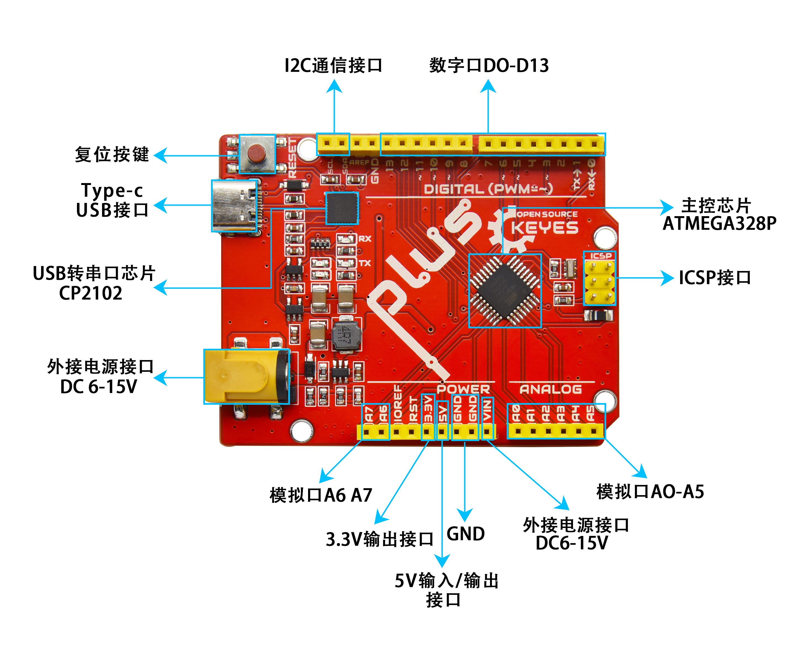

接口简介

串口通信接口：D0为RX、D1为TX

PWM接口（脉宽调制）：D3 D5 D6 D9 D10 D11

外部中断接口：D2(中断0)和D3 (中断1)

SPI通信接口：D10为SS、D11为MOSI、D12为MISO、D13为SCK

IIC通信端口：A4为SDA、A5为SCL

时钟频率

主板使用16 MHz晶振

## 第2小节 了解米思奇

上一节我们了解了keyes UNO PLUS开发板，这节课我们开始学习米思奇图形化编程软件

1.Mixly简介

Mixly是一款由北京师范大学教育学部创客教育实验室傅骞教授团队基于Google的Blockly图形化编程框架开发的免费开源的图形化Arduino编程软件。是一款面向创意电子开发的免费开源图形化编程工具；一个面向创意电子教育的完整支持生态；一个创客教育工作者实现梦想的舞台。

可以说Mixly是目前功能最丰富，操作最流畅的Arduino图形化编程软件，几乎可以替代Arduino IDE编程工具。

米思齐软件下载地址

<http://mixly.org/explore/software/mixly-arduino>

2.Mixly的设计理念及适合人群

2.1设计理念

（1）易用性

Mixly在设计上做到了完全绿色使用。目前Mixly支持win、ubuntu、mac。Windows用户直接从网上下载Mixly软件包，解压后即可在Windows XP及以上版本的操作系统运行（下文附有下载链接）。

（2）简单性

Mixly采用了Blockly图形化编程引擎，使用图形化的积木块代替了复杂的文本操作，为初学者的快速入门奠定了良好的基础。①用不同颜色的示意图标代表不同类型的功能块，方便用户归类区分。②在复合功能块中提供默认选项，有效减少用户的拖动次数。③在同一个界面整合软件的所有功能。④提供参考教程及代码示例。 

（3）功能性

功能多样，arduino IDE能实现的功能和函数，Mixly也几乎都可以实现。支持arduino所有的官方开发板。

（4）延续性

图形化编程系统的目标绝对不是替换原有的文本编程方式，而是希望通过图形化编程更好更快地理解编程的原理和程序的思维，并为未来的文本编程打好基础。Mixly的设计理念也是如此。在软件的设计上加入了更多的可延续性内容，从而保护了用户的学习成果。具体来说，包括引入变量类型、在模块的设计上尽量保持和文本编程的一致、支持图形编程和文本编程的对照等。 

（5）生态性 

生态性是Mixly最重要的设计理念，也是它区别于其他Arduino图形化编程的最重要特征。为了实现可持续发展，Mixly在设计上既允许厂商开发自己的特有模块，用户需要有JavaScript编程基础才能制作这部分模块，也允许用户直接利用Mixly的图形化编程功能生成通用模块（如数码管显示、蜂鸣音播报等，用户只需会使用Mixly即可制作这部分模块）。以上两类模块均可通过“导入库”功能导入Mixly系统，从而在Mixly软件的普及中实现用户自身的价值。

2.2合适人群

从以上的设计理念，可以看出，Mixly适合中小学生来学习编程思维。也适合创客制作作品时能快速编程。当然更适合一些不想学文本编程，却想做一些智能控制小作品的大朋友们。

3.Mixly界面功能介绍

3.1 Mixly系统功能简介

Mixly的主界面由左上的模块选择区、中上的程序构建区、右上的代码程序区（可隐藏）、中部的系统功能区和下部的消息提示区构成。

如下图所示：

界面一些常用的功能：通过该界面，用户可以完成程序的编写、上传、保存、代码查看等全部工作。支持程序块向左拖出编程窗、拖拽至垃圾桶、delete键及右键delete四种删除方式；软件支持4种语言：English、Español、中文简体、中文繁体
。

3.2 IO功能模块：主板是keyes UNO R3开发板

3.3 控制模块

3.4 数学模块

3.5文本模块

3.6 List模块

3.7 Logic模块

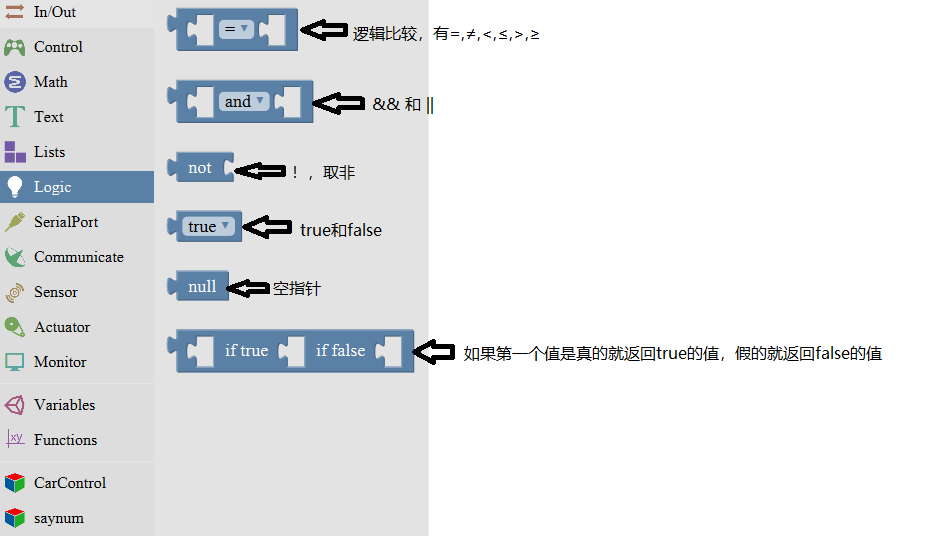

3.8 Variable模块

3.9 SerialPort模块

3.10 Communicate模块

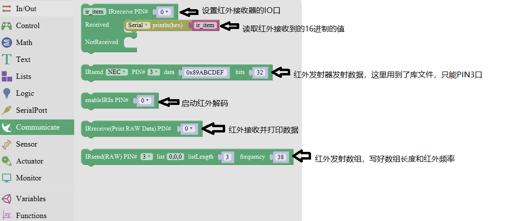

3.11 Sensor模块

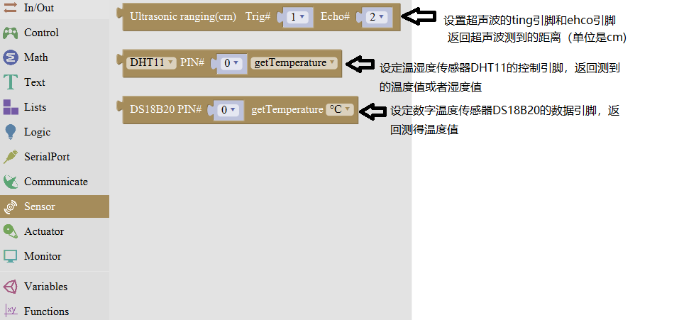

3.12 Actuator模块

3.13 Monitor模块

3.14 Function模块

## 第3小节 米思奇库文件添加

为了方便实验程序制作，我们特别为这款套件制作了一个小车库文件。库文件的导入，导出和编辑如下图所示。

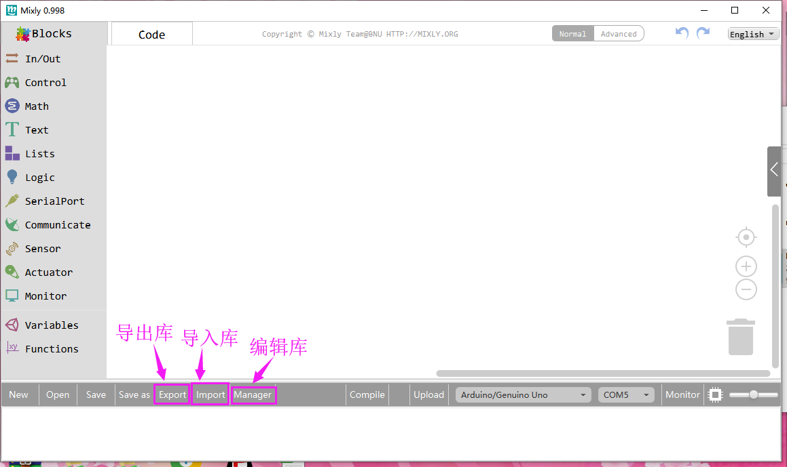

点击导入库，进入库文件（文件夹），点击文件，库文件

就导入成功。

## 第4小节 keyes UNO PLUS开发板的驱动安装方法

我们开始为Keyes Uno Plus 开发板安装驱动。Keyes Uno Plus
开发板的USB转串口 芯片用的是著名的CP2102
芯片，在米思奇软件安装目录下的“arduino”--\>“drivers”
文件夹下已经包含了这个芯片的驱动程序，这样我们使用起来会非常方便。一般插
上USB，电脑就会识别到硬件，WINDOWS就会自动安装CP2102的驱动。

如果驱动安装不成功，或者你想手动安装驱动，请打开电脑的设备管理器

显示CP2102的驱动没有安装成功，有一个黄色的感叹号。我们双击硬件更新驱动

浏览计算机查找驱动程序，先找到米思奇软件安装目录下的“arduino”--\>“drivers”文件夹，

打开文件夹就能看到CP210X系列芯片的驱动，

我们选择这个文件夹，然后点击确定，驱动安装成功。

这个时候再打开设备管理器，我就可以看到CP2102的驱动程序已经安装成功了，刚刚的那个黄色的感叹号不见了。

# 模块实验课程

拿到套件后，我们可以看到套件中有24款传感器/模块，有对应的keyes UNO PLUS

开发板、传感器扩展板和连接线。这里，我们将24款传感器/模块利用自带连接线，单独连接在keyes UNO R3开发板和传感器扩展板。然后上传对应的测试代码，单独测试各个传感器/模块的功能。

特别注意：实验时，模块/传感器连接线材时，必须按照资料里的接线方法及位置，电源与信息脚不能错接，否则会损坏模块/传感器。

## 实验一 LED 模块测试

实验说明

在这个套件中，我们们有keyes brick LED红发红模块、keyes brick LED黄发黄模块和keyes brick 3W LED模块共3种LED模块。3钟LED模块控制方法完全一样，只是LED颜色和亮度不同而已。控制时，GND VCC上电后；信号端S为高电平时LED亮起，S为低电平时LED熄灭。

实验中，我们提供两个测试代码，分别控制LED模块上实现闪烁和呼吸灯的效果。闪烁效果好理解；呼吸灯效果，就是控制LED模块上LED首先逐渐变亮，然后逐渐变暗，循环交替，如人体呼吸一样。

实验器材

keyes brick LED红发红模块\*1

或者keyes brick LED黄发黄模块

或者keyes brick 3W LED模块

keyes UNO PLUS开发板\*1

传感器扩展板\*1

3P 双头XH2.54连接线\*1

USB线\*1

接线图

测试代码

代码1：

代码2：

代码说明

代码1说明：

1.  代码1中我们从库文件中找到，和库文件中的功能一样，它们都是LED模块，设置方法一样，可以通用，只是LED亮度、颜色不一样而已。

2.  中，管脚是指模块信号端连接的接口，通过接线图，我们方向模块信号端连接在D3，因此，代码中我们把管脚设置为3。是指，我们可以将模块信号端S设置为高低电平。我们测试的过程中，当模块S端设为高电平（高）时，模块上LED亮起，设为低电平（低）时，模块上LED熄灭。

3.  代码中代码延迟时间，单位毫秒，代表延迟1000毫秒，即1秒。

4.  在米思齐软件中，只要没有单元，就代表代码中所有设置都是循环的。

5.  通过整合前面知识。我们再来看代码就清楚明了了，代码中第一条我们把模块信号端接到D3，设置为高电平，就是点亮模块上LED；第二条延迟1000毫秒，就是让模块上LED点亮1秒。同样第三条第四条代码表示让模块上LED熄灭1秒。代码默认循环，也就是控制模块上LED，循环亮1秒，灭1秒，实现闪烁效果。通过代码设置，我们可以更改模块上LED亮灭的延迟时间，从而使模块上LED实现不同的闪烁效果。

    **代码2说明：**

1.  代码中，用到了单元，代码改单元中的代码设置
    只执行1次，然后后面的代码就一直是循环的了。

2.  代码1中，我们控制模块上信号端控制LED亮灭。在代码2中，我们通过利用keyes     UNO     R3开发板上PWM口，设置PWM值，控制模块上LED亮度。只有PWM口的原理，这里就不多介绍了，网上有很多信息。

3.  keyes UNO R3开发板上只有D3 D5 D6 D9 D10     D11数字口是PWM口，也就是说如果要控制LED的亮度，信号端就只能接着几个接口。实验中，我们将模块信号端接在D3脚，属于PWM口。设置时我们设置PWM数值越小，模块上LED越暗，数值越大，模块上LED越亮，范围为0-255。

4.  ，初始化时，我们将D3的PWM数值设置为0，即熄灭模块上的LED。

5.  代表设置一个变量i，i从0直接增加到255，每一次都加1，总共加了255次。

6.  代表将D3的PWM值设置为i，代表延迟10毫秒；和前面代码搭配，代表每过10毫秒，变量i都加1，直到i为255。

7.  代表设置一个变量i，i从255直接减小到0，每一次都加-1，总共加了255次。

8.  通过整合前面知识，我们再来看代码，就清楚多了。初始时我们将D3端设置为0，熄灭模块上LED。然后开始循环，将D3的PWM值设置为i，i刚开始由0增加到255，每次加1，每加一次延迟10毫秒，模块上LED逐渐变亮。PWM为255后，i开始由255减小到0，每次减1，每减一次延迟10毫秒，模块上LED逐渐变暗。然后又逐渐变亮，循环交替，如人体呼吸一样。

9.  如果我们感觉逐渐变亮
    或者逐渐变暗的时间过长，我们可以更改代码设置。有两种方法，一种是将每次加1减1的延迟时间降低；另一种是更改步长，注意这个步长必须能被255整除，如3     5。步长改为3 -3代表i每次增加3或减小3。

测试结果

上传测试代码1成功，上电后，LED模块上LED开始闪烁，亮1秒，灭1秒，循环交替。上传测试代码2成功，上电后，LED模块上LED开始逐渐变亮，然后开始逐渐变暗，循坏交替，如人体呼吸一样。

## 实验二 插件RGB模块调节RGB LED颜色

实验说明

在这个套件中，有一个插件RGB模块，它采用F5-全彩RGB雾状共阴LED元件。控制时，我们需要将模块R G
B连接单片机PWM口，-接GND。我们通过调节3个PWM值，控制LED元件显示红光、绿光和蓝光的比例，从而控制RGB模块上LED显示不同颜色灯光。当设置的PWM值越大，对应显示的颜色比例越重。理论来说，通过调节这3中颜色光的混合比例，可以模拟出所有颜色的灯光。

实验中，我们通过测试代码，控制模块上RGB LED显示几个常用颜色。

实验器材

keyes brick 插件RGB模块\*1

keyes UNO PLUS开发板\*1

传感器扩展板\*1

4P 双头XH2.54连接线\*1

USB线\*1

接线图

测试代码

代码1：

代码2：

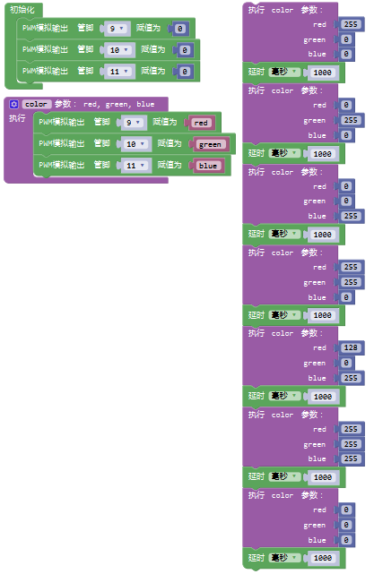

代码说明

代码1说明：

1.  代码1中，我们利用了库文件中设置方法，

    中R     G B代表控制模块上

    LED对应的红绿蓝3种颜色对应的端口，根据接线图我们接到了D9 D10     D11，设置为9

    10 11，后面设置对应高低电平，设置GRB     LED中红绿蓝3个灯是否会亮，不能任意调节比例。

2.  现在观察代码，这个代码非常简单，只是简单的控制模块上RGB     LED显示红色1秒、

    绿色1秒、蓝色1秒，循环交替。

    **代码2说明：**

1.  初始化 时设置D9 D10 D11的PWM值为0，熄灭模块上RGB LED。

2.  开始设置一个子程序，找到函数选项，找到项，选择使用该单元。

    点击标志设置子程序框架，将拉入，连续拉入3个该单元；点击设置3个参数类型，我们都设置为整数，点击设置参数名称；子程序框架设置成功，显示，点击标志，退出子程序框架设置。设置完后，我们可以在单元中，找到设置的3个名称的参数。

3.  设置框架成功后，显示，点击，设置子程序名称，我们设置为color。

4.  子程序框架名称设置成功后，我们就开始设置子程序。根据接线，我们D9控制RGB     LED显示红光，D10控制RGB LED显示绿光，D11控制RGB     LED显示蓝光。我们利用这3个PWM口的PWM值控制RGB     LED显示不同颜色。控制对应的PWM值越大，对应显示的颜色比例越重。因此，子程序我们设置为。

5.  子程序设置成功后，我们就可以在中找到，这里我们通过设置这3个参数，控制模块上RGB     LED显示不同颜色、亮度，理论来说，可以设置RGB     LED显示所有颜色，总共有255\*255\*255种排列组合。

6.  设置时，如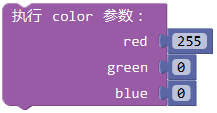表示使RGB     LED显示最亮的红色。

    表示使RGB     LED显示紫色。

测试结果

上传测试代码1成功，上电后，模块上RGB LED循环显示红绿蓝3种颜色，间隔时间为1秒。上传测试代码2成功，上电后，模块上RGB LED显示红绿蓝黄紫白6种颜色，然后熄灭，循环不止，间隔时间为1秒。

## 实验三 热敏电阻传感器简单测试

实验说明

在这个套件中，有一个热敏电阻传感器，它主要采用NTC-MF52AT热敏电阻元件。NTC-MF52AT热敏电阻元件能够时感知周边环境温度的变化，电阻大小随着温度的变化而变化。该传感器就是利用NTC-MF52AT热敏电阻元件这一特性，搭建电路将电阻变化转换为电压变化。

实验中，我们将传感器信号端接到keyes UNO R3开发板模拟口，读出对应的模拟值。我们可以利用模拟值，通过特定公式，计算出当前环境的温度。由于温度计算公式比较复杂，这里就不多介绍了。实验中，我们只是读取对应的模拟值。

实验器材

keyes brick 热敏电阻传感器\*1

keyes UNO PLUS开发板\*1

传感器扩展板\*1

3P 双头XH2.54连接线\*1

USB线\*1

接线图

测试代码

代码说明

1.  在单元找到，设置波特率为9600，我们可

    以更改9600，设置各种波特率。

2.  ，是指将模拟温度传感器信号端接在

    A3，读取A3端的模拟值，在串口监视器上显示，没显示一次新数据，自动换一行显示。

3.  为了方便观察数据，后面加个延迟100毫秒。

测试结果

上传测试代码成功，利用USB线上电后，打开串口监视器，设置波特率为9600。串口监视器显示对应的模拟值，温度越高，模拟值越大。

## 实验四 无源蜂鸣器模块播放音乐

实验说明

在这个套件中，有一个无源蜂鸣器模块，它主要采用12\*8.5MM 5V 2K无源蜂鸣器元件。无源蜂鸣器元件内部不带震荡电路，控制时，我们只需要在蜂鸣器元件正极输入不同频率的方波（电压5V），负极接地，控制蜂鸣器响起不同频率的声音。该元件的中心频率是2KHz。无源蜂鸣器驱动频率与发生频率之间是一一对应的关系，即驱动频率是2KHz的方波，那听到的声音频率也是2KHz。

实验中，我们利用无源蜂鸣器模块上蜂鸣器输出各种频率的声音，然后控制无源蜂鸣器模块上蜂鸣器播放完整音乐。

实验器材

keyes brick 无源蜂鸣器模块\*1

keyes UNO PLUS开发板\*1

传感器扩展板\*1

3P 双头XH2.54连接线\*1

USB线\*1

接线图

测试代码

代码1：

代码2：

代码说明

代码1说明：

1.  在的单元找到

    ，其中管脚是代码模块信号端接口，我们连接的是D3，所以设置为3；音调设置对应的是模块上无源蜂鸣器发出的频率，我们可以点击米思齐软件上代码按键，看到对应频率；节拍对应的是各个频率延迟的时间，1个节拍就是延迟1秒。

2.  同样，可以在的单元找到

    ，管脚我们同样设置为3，代码1中为了方便观察效果，我们在后面加了延迟500毫秒。

    **代码2说明：**

1.  同样，可以，在的单元找到

    ，管脚我们设置为3。我们库文件中，直接利用代码

    控制频率和节拍，使蜂鸣器直接播放《圣诞歌》和《生日快乐》歌曲。

测试结果

上传测试代码1成功，上电后，模块上无源蜂鸣器循环播放对应频率对应节拍的声音。上传测试代码2成功，上电后，模块上无源蜂鸣器循环播放《圣诞歌》和《生日快乐》两首歌曲。

## 实验五 霍尔传感器检测磁场

实验说明

在这个套件中，有一个霍尔传感器，它主要采用A3144霍尔元件。该元件是由电压调整器、霍尔电压发生器、差分放大器、史密特触发器，温度补偿电路和集电极开路的输出级组成的磁敏传感电路，其输入为磁感应强度，输出是一个数字电压讯号。它是单极开关型的霍尔传感器，只感应南极磁场。传感器感应到无磁场或北极磁场时，信号端为高电平；感应到南极磁场时，信号端为低电平。当感应磁场强度越强时，感应距离越长。

实验中，我们利用霍尔传感器检测南极磁场，将测试结果在串口监视器上显示。

实验器材

keyes brick 霍尔传感器\*1

keyes UNO PLUS开发板\*1

传感器扩展板\*1

3P 双头XH2.54连接线\*1

USB线\*1

接线图

测试代码

代码说明

1.  在单元找到，设置item初始变亮为

    整数，并赋值为0，。

2.  初始化设置波特率为9600。

3.  同样，可以在的单元找到

    ，管脚我们同样设置为3。我们将读取到D3读取到的数字值赋值给item，。

4.  在单元内，找到，点击进行设置，我们可以在里面任

    意添加 如果否则 否则逻辑单元，如下图。

    

    我们实验中，只需要添加一个
    否则单元，设置完成后点击，完成设置。

    

5.  代码逻辑是传感器感应到南极磁场时，信号端为低电平，D3口为低电平，即item为

    0。这时我们在串口监视器显示对应的数字值和字符；否则（传感器感应到无磁场或北极磁场时），item为1，窗口监视器显示1和另外的字符。

    

测试结果

上传测试代码成功，利用USB线上电后，打开串口监视器，设置波特率为9600。当传感器感应到南极磁场时，传感器监视器显示如图1；当传感器感应到无磁场或北极磁场时，串口监视器显示如图2。

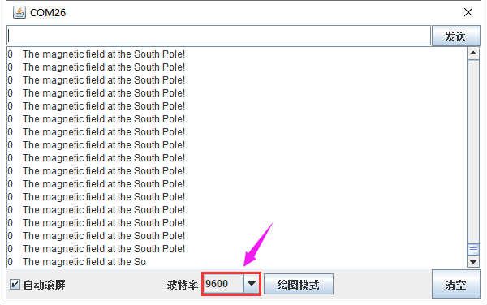图1

图2

## 实验六 敲击模块传感器检测状态

实验说明

在这个套件中，有一个敲击模块传感器，它主要采用SW-2802振动开关元件。SW-2802振动开关元件是弹簧型震动感应触发开关。该振动开关在静止時为开路OFF状态，
当受到外力碰触而达到相应震动力时,或移动速度达到适当离(偏)心力时，导电接脚会产生瞬间导通呈瞬间ON状态;当外力消失時,开关恢复为开路OFF状态。该传感器就是利用元件这一特性，搭建电路将震动信号转换为高低电平变换信号。

实验中，我们利用敲击模块传感器检测敲击状态，将测试结果在串口监视器上显示。

实验器材

keyes brick 敲击模块传感器\*1

keyes UNO PLUS开发板\*1

传感器扩展板\*1

3P 双头XH2.54连接线\*1

USB线\*1

接线图

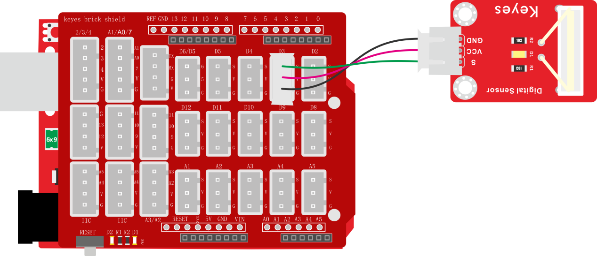

测试代码

代码说明

1.  在实验二中，我们教了怎么设置子程序。

2.  在这一实验中，我们主要接触到的新知识是中断知识。keyes UNO     R3开发板的中断

    口是数字口2和数字口3，我们把信号端设置在数值口3了。

3.  我们在 找到，设置管脚为3，

    有3中模式：上升、下降和改变。没有敲击时，传感器信号端为高电平，感受到敲击信号，传感器信号端变为低电平；因此我们设置为下降。

    4、中断设置为，就是说，传感器感应到敲击信号，中断口3下降，执行子程序，否则执行循环程序。

测试结果

上传测试代码成功，利用USB线上电后，打开串口监视器，设置波特率为9600。当传感器敲击信号时，传感器监视器显示“Knock on!”字符；否则显示“All going well!”字符，如下图。

## 实验七 旋转编码器模块计数

实验说明

在这个套件中，有一个keyes brick
旋转编码器模块，它主要采用20脉冲旋转编码器元件。它可通过旋转计数正方向和反方向转动过程中输出脉冲的次数，这种转动计数是没有限制的，复位到初始状态，即从0开始计数。如果我们只计算信号的脉冲，则可以使用两个输出中的任何一个来确定旋转位置。但是，如果我们想要确定旋转方向，我们需要同时考虑两个信号。

实验中，我们利用keyes brick
旋转编码器模块用于计数，当我们顺时针旋转编码器时，设置数据i加1；逆时针旋转编码器时，设置数据i减1；按下编码器中间按键时，设置数据i为0；将测试结果在串口监视器上显示。

实验器材

keyes brick 旋转编码器模块\*1

keyes UNO PLUS开发板\*1

传感器扩展板\*1

5P双头XH2.54连接线\*1

USB线\*1

接线图

测试代码

代码说明

1.  在实验中，我们需要在库文件的单元内，找到以下元件。

    

    2\.     我们把CLK设置为2、DAT设置为3。该代码在库文件中设置好了，它的意思是中断2（CLK）下降后，读取数字口3（DAT）电压，当DAT电压为高电平时，i加1；当DAT电压为低电平时，i减1。我们可以打开米思齐软件中的看到对应设置的C语言代码。

    3\. 然后循环程序中设置按钮管脚（D4）为低电平时，i设置为0。

    4\. 将i的数据在串口监视器中打印出来，设置串口打印时，必须在初始化中设置波特率。

测试结果

上传测试代码成功，利用USB线上电后，打开串口监视器，设置波特率为9600。顺时针旋转编码器，显示数据增加；逆时针旋转编码器，显示数据减小；按下编码器中间按键，显示数据为0，如下图。

## 实验八 DS18B20温度传感器测试温度

实验说明

在这个套件中，有一个keyes brick 18B20温度传感器，它主要采用DS18B20传感器元件。我们可以利用该传感器测试当前环境中的温度。它的测量范围为－55℃～＋125℃，测量精度为±0.5℃（-10℃至+85℃范围内）。

实验中，我们利用这个温度传感器测试当前环境中的温度，测试结果分为℃和℉两种；并且，我们在串口监视器上显示测试结果。

实验器材

keyes brick 18B20温度传感器\*1

keyes UNO PLUS开发板\*1

传感器扩展板\*1

3P双头XH2.54连接线\*1

USB线\*1

接线图

测试代码

代码说明

1\. 在实验中，我们需要在库文件的单元内，找到以下元件。

2\. 我们把管脚设置为3，获取温度的单位分别设置为℃和℉。

3\. 设置两个小数变量，分别为val1和val2，将所测结果赋值给val1和val2。

4\.
串口监视器显示val1和val2的值，显示前需设置波特率（我们默认设置为9600，可更改）。

5\.
显示时，我们在数据后面添加单位，如果单位直接设置为℃和℉，测试结果会出现乱码。所以我们直接用C代替℃，F代替℉。

测试结果

上传测试代码成功，利用USB线上电后，打开串口监视器，设置波特率为9600。串口监视器显示当前环境的温度，如下图。

## 实验九 光敏电阻传感器测试光照强度

实验说明

在这个套件中，有一个keyes brick
光敏电阻传感器，它是一个常用的光敏电阻传感器，它主要采用光敏电阻元件。该电阻元件电阻大小随着光照强度的变化而变化，当环境中有亮光的时候，电阻大小为5-10KΩ；没有亮光时，电阻大小为0.2MΩ。该传感器就是利用光敏电阻元件这一特性，搭建电路将电阻变化转换为电压变化。

实验中，我们利用这个传感器测试当前环境中的光照强度对应的模拟值，光照越强，模拟值越大；并且，我们在串口监视器上显示测试结果。

实验器材

keyes brick 光敏电阻传感器\*1

keyes UNO PLUS开发板\*1

传感器扩展板\*1

3P双头XH2.54连接线\*1

USB线\*1

接线图

测试代码

代码说明

1\. 在实验中，我们需要在库文件的单元内，找到以下元件。

2\. 我们把管脚设置为A3。

3\. 设置1个整数变量item，将所测结果赋值给item。

4\.
串口监视器显示item的值，显示前需设置波特率（我们默认设置为9600，可更改）。

测试结果

上传测试代码成功，利用USB线上电后，打开串口监视器，设置波特率为9600。串口监视器显示对应模拟值。实验中，我们把传感器用手握住，逐渐松开，光照逐渐变强，可以逐渐看到模拟值数据变大，如下图。

## 实验十 可调电位器模块读取模拟值

实验说明

在这个套件中，有一个keyes brick 可调电位器模块，它主要采用一个10K
可调电阻。通过旋转电位器，我们可以改变电阻大小，然后搭建电路将电阻变化转换为电压变化。

实验中，我们利用这个模块测试对应的模拟值；并且，我们在串口监视器上显示测试结果。

实验器材

keyes brick 可调电位器模块\*1

keyes UNO PLUS开发板\*1

传感器扩展板\*1

3P双头XH2.54连接线\*1

USB线\*1

接线图

测试代码

代码说明

1\. 在实验中，我们需要在库文件的单元内，找到以下元件。

2.  其他设置方法和上一课程类似，都是读取对应的模拟值，这里就不多介绍了。

测试结果

上传测试代码成功，利用USB线上电后，打开串口监视器，设置波特率为9600。串口监视器显示对应模拟值。实验中，顺时针旋转电位器，模拟值增大，逆时针旋转电位器，模拟值减小，范围为0-1023，如下图。

## 实验十一 避障传感器检测障碍物

实验说明

在这个套件中，有一个keyes brick避障传感器，它主要采用一对红外线发射与接收管元件。原理就是发射管发射出一定频率的红外线，当检测方向遇到障碍物（反射面）时，红外线反射回来被接收管接收，此时指示灯亮起，经过电路处理后，信号输出接口输出数字信号。传感器上有两个电位器，一个用于调节发送功率，一个用于调节接收频率，通过调节2个电位器，我们可以调节它的有效距离。

实验中，我们通过读取传感器上S端高低电平，判断是否存在障碍物；并且，我们在串口监视器上显示测试结果。

实验器材

keyes brick避障传感器\*1

keyes UNO PLUS开发板\*1

传感器扩展板\*1

3P双头XH2.54连接线\*1

USB线\*1

接线图

测试代码

代码说明

1\. 在实验中，我们需要在库文件的单元内，找到以下元件。

2\. 我们把管脚设置为D3。

3\. 设置1个整数变量item，将所测结果赋值给item。

4\.
串口监视器显示item数据，然后我们根据item数据判断是否存在障碍物，并在串口监视器上显示对应字符。

5\. 判断语句设置，我们可以参考实验五知识，这里就不多介绍了。

特别注意

烧录好测试代码，按照接线图连接好线，上电后，我们开始调节两个电位器调节感应距

离。

1.  调节发射功率调节电位器，先将电位器顺时针到尽头，然后回调一些，使传感器上

    D1 LED介于不亮与亮之间的零界点。

2.  调节接收频率调节电位器，顺时针调节时，频率增大。调节使它产生38KHz频率的方波，调节时，也观察传感器上D1     LED，使它介于不亮与亮之间的零界点。

测试结果

上传测试代码成功，利用USB线上电后，打开串口监视器，设置波特率为9600。串口监视器显示对应数据和字符。实验中，当传感器检测到障碍物时，item为0，串口监视器显示“There are obstacles”字符；没有检测到障碍物时，item为1，串口监视器显示“All going well”字符，如下图。

## 实验十二 按键传感器检测实验

实验说明

在这个套件中，有一个keyes brick按键传感器，它主要采用1个轻触开关，自带1个黄色按键帽。当我们按下按键时，传感器信号端为低电平；松开按键时，信号端为高电平。

实验中，我们通过读取传感器上S端高低电平，判断传感器上按键是否按下；并且，我们在串口监视器上显示测试结果。

实验器材

keyes brick按键传感器\*1

keyes UNO PLUS开发板\*1

传感器扩展板\*1

3P双头XH2.54连接线\*1

USB线\*1

接线图

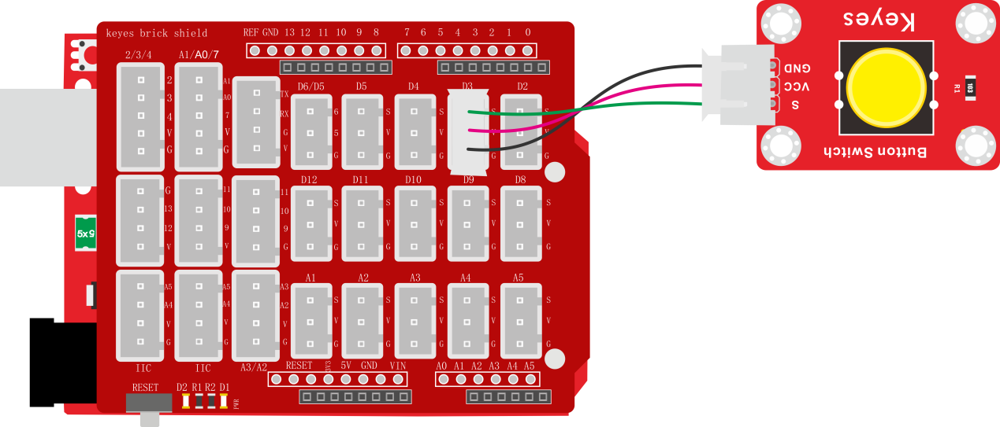

测试代码

代码说明

1\. 在实验中，我们需要在库文件的单元内，找到以下元件。

2\. 其它设置方法和上一课程类似，这里就不多做介绍了。

测试结果

上传测试代码成功，利用USB线上电后，打开串口监视器，设置波特率为9600。串口监视器显示对应数据和字符。实验中，当传感器按下按键时，item为0，串口监视器显示“Press the button”字符；松开按键时，item为1，串口监视器显示“Loosen the button”字符，如下图。

## 实验十三 干簧管检测附近磁场

实验说明

在这个套件中，有一个keyes brick 干簧管模块，它主要采用MKA10110
绿色磁簧元件元件。簧管是干式舌簧管的简称，是一种有触点的无源电子开关元件，具有结构简单，体积小便于控制等优点。它的外壳是一根密封的玻璃管，管中装有两个铁质的弹性簧片电板，还灌有一种惰性气体。平时，玻璃管中的两个由特殊材料制成的簧片是分开的。当有磁性物质靠近玻璃管时，在磁场磁力线的作用下，管内的两个簧片被磁化而互相吸引接触，簧片就会吸合在一起，使结点所接的电路连通。外磁力消失后，两个簧片由于本身的弹性而分开，线路也就断开了。该传感器就是利用元件这一特性，搭建电路将磁场信号转换为高低电平变换信号。

实验中，我们通过读取模块上S端高低电平，判断模块附近是否存在磁场；并且，我们在串口监视器上显示测试结果。

实验器材

keyes brick干簧管模块\*1

keyes UNO PLUS开发板\*1

传感器扩展板\*1

3P双头XH2.54连接线\*1

USB线\*1

接线图

测试代码

代码说明

1\. 在实验中，我们需要在库文件的单元内，找到以下元件。

2\. 其它设置方法和实验十一类似，这里就不多做介绍了。

测试结果

上传测试代码成功，利用USB线上电后，打开串口监视器，设置波特率为9600。串口监视器显示对应数据和字符。实验中，当传感器检测到磁场时，item为0，串口监视器显示“A magnetic field”字符；没有检测到磁场时，item为1，串口监视器显示“There is no magnetic field”字符，如下图。

## 实验十四 DHT11温湿度传感器检测温湿度

实验说明

在这个套件中，有一个keyes brick DHT11温湿度传感器，它主要采用DHT11
温湿度传感器元件。它是一款含有已校准数字信号输出的温湿度复合传感器。它应用专用的数字模块采集技术和温湿度传感技术，确保产品具有极高的可靠性与卓越的长期稳定性。传感器包括一个电阻式感湿元件和一个NTC测温元件，并与一个高性能8位单片机相连接。因此该产品具有品质卓越、超快响应、抗干扰能力强、性价比极高等优点。

实验中，我们利用这个传感器测试当前环境中的温湿度，并且，我们在串口监视器上显示测试结果。

实验器材

keyes brick DHT11温湿度传感器\*1

keyes UNO PLUS开发板\*1

传感器扩展板\*1

3P双头XH2.54连接线\*1

USB线\*1

接线图

测试代码

代码说明

1\. 在实验中，我们需要在库文件的单元内，找到以下元件。

2\. 我们把管脚设置为3，选择获取温度和获取湿度。

3\. 设置两个小数变量，分别为val1和val2，将所测结果赋值给val1和val2。

4\.
串口监视器显示val1和val2的值，显示前需设置波特率（我们默认设置为9600，可更改）。

5\.
显示时，我们在数据后面添加单位。如果温度单位直接设置为℃，测试结果会出现乱码，所以我们直接用C代替℃；湿度单位直接设置为%。

测试结果

上传测试代码成功，利用USB线上电后，打开串口监视器，设置波特率为9600。串口监视器显示当前环境中的温湿度数据，如下图。

## 实验十五 激光头传感器模块检测实验

实验说明

在这个套件中，有一个keyes brick DHT11激光头传感器模块，它主要由1个铜材半导体激光管元件组成。控制时，我们需要在模块S端输入高电平信号，模块开始工作，激光管发射出红色激光信号。

实验中，我们只是控制这个传感器模块上的激光头循环发射激光。

实验器材

keyes brick 激光头传感器模块\*1

keyes UNO PLUS开发板\*1

传感器扩展板\*1

3P双头XH2.54连接线\*1

USB线\*1

接线图

测试代码

代码说明

1\.
在实验中，我们需要在库文件的单元内，找到以下元件。

2\.
我们把管脚设置为2，设置为高时，模块上激光发射；设置为低时，模块上激光停止发射。

测试结果

上传测试代码成功，上电后，模块上激光发射1秒，停止发射1秒，循环交替。

## 实验十六 麦克风声音传感器检测声音大小

实验说明

在这个套件中，有一个keyes brick
麦克风声音传感器，它主要采用一个高感度麦克风元件和LM386芯片。高感度麦克风元件用于检测外界的声音。利用LM386芯片搭建合适的电路，我们对高感度麦克风检测到的声音进行放大，最大倍数为200倍。使用时我们可以通过旋转传感器上电位器，调节声音的放大倍数。调节时，顺时针调节电位器到尽头，放大倍数最大。

实验中，我们利用这个传感器测试当前环境中的声音大小对应的模拟值，声音越大，模拟值越大；并且，我们在串口监视器上显示测试结果。

实验器材

keyes brick 麦克风声音传感器\*1

keyes UNO PLUS开发板\*1

传感器扩展板\*1

3P双头XH2.54连接线\*1

USB线\*1

接线图

测试代码

代码说明

1\. 在实验中，我们需要在库文件的单元内，找到以下元件。

2\. 我们把管脚设置为A3。

3\. 设置1个整数变量item，将所测结果赋值给item。

4\.
串口监视器显示item的值，显示前需设置波特率（我们默认设置为9600，可更改）。

测试结果

上传测试代码成功，利用USB线上电后，打开串口监视器，设置波特率为9600。串口监视器显示对应模拟值。实验中，我们顺时针旋转电位器和对准MIC头大声说话，可以看到模拟值数据变大，如下图。

## 实验十七 有源蜂鸣器模块播放声音

实验说明

在这个套件中，包含一个有源蜂鸣器模块，一个无源蜂鸣器模块。在实验四中，介绍了无源蜂鸣器模块播放各个频率声音的方法。这个实验中，我们控制有源蜂鸣器发出声音。有源蜂鸣器元件内部自带震荡电路，控制时，我们只需要在蜂鸣器元件正极输入5V电源，负极接地，蜂鸣器就自动响起。

实验中，我们只是控制这个模块上有源蜂鸣器的循环响起声音。

实验器材

keyes brick 有源蜂鸣器模块\*1

keyes UNO PLUS开发板\*1

传感器扩展板\*1

3P双头XH2.54连接线\*1

USB线\*1

接线图

测试代码

代码说明

1\.
在实验中，我们需要在库文件的单元内，找到以下元件。

2\.
我们把管脚设置为3，设置为高时，模块上有源蜂鸣器响起；设置为低时，模块上有源蜂鸣器关闭声音。

测试结果

上传测试代码成功，上电后，模块上有源蜂鸣器响起1秒，关闭1秒，循环交替。

## 实验十八 巡线传感器检测黑白线

实验说明

在这个套件中，有一个keyes brick 巡线传感器，它主要采用1个TCRT5000
反射型
黑白线识别传感器元件。传感器的原理是利用红外线对颜色的反射率不一样，将反射信号的强弱转化成电流信号。传感器没有检测到物体或者检测到黑色物体时，信号端为高电平；检测到白色物体时，信号端为低电平；它的检测高度为
0—3cm。我们可以通过旋转传感器上电位器，调节灵敏度，即调节检测高度。当旋转电位器，是传感器上D1 LED介于不亮与亮之间的临界点时，灵敏度最好。

实验中，我们通过读取模块上S端高低电平，判断传感器检测到的物体颜色（黑白）；并且，我们在串口监视器上显示测试结果。

实验器材

keyes brick巡线传感器\*1

keyes UNO PLUS开发板\*1

传感器扩展板\*1

3P双头XH2.54连接线\*1

USB线\*1

接线图

测试代码

代码说明

1\. 在实验中，我们需要在库文件的单元内，找到以下元件。

2\. 其它设置方法和实验十一类似，这里就不多做介绍了。

测试结果

上传测试代码成功，利用USB线上电后，打开串口监视器，设置波特率为9600。串口监视器显示对应数据和字符。实验中，当传感器没有检测到物体或者检测到黑色物体时，item为1，串口监视器显示“Black”字符；检测到白色物体（能够反光）时，item为0，串口监视器显示“White”字符，如下图。

## 实验十九 左右倾斜检测

实验说明

在这个套件中，有一个keyes brick 倾斜模块传感器，它主要采用SW-200D
振动开关元件。SW-200D
振动开关元件是滚珠型倾斜感应单方向性触发开关。该振动开关两端一端镀金，一端镀银；镀金端为触发端，镀银端为导电端。当传感器在水平位置或向导电端（镀银）倾斜时，开关元件为开路OFF状态，传感器信号端输出高电平；当传感器向触发端（镀金）倾斜时，开关元件为闭路ON状态，传感器信号端输出低电平。

实验中，我们通过读取模块上S端高低电平，判断传感器倾斜的方向；并且，我们在串口监视器上显示测试结果。

实验器材

keyes brick 倾斜模块传感器\*1

keyes UNO PLUS开发板\*1

传感器扩展板\*1

3P双头XH2.54连接线\*1

USB线\*1

接线图

测试代码

代码说明

1\. 在实验中，我们需要在库文件的单元内，找到以下元件。

2\. 其它设置方法和实验十一类似，这里就不多做介绍了。

测试结果

上传测试代码成功，利用USB线上电后，打开串口监视器，设置波特率为9600。串口监视器显示对应数据和字符。实验中，手握传感器白色接口，当传感器向右倾斜时，item为0，串口监视器显示“Right”字符；当传感器向左倾斜时，item为1，串口监视器显示“Left”字符，如下图。

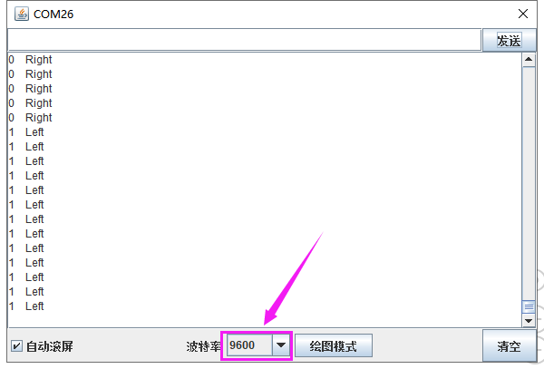

## 实验二十 碰撞检测

实验说明

在这个套件中，有一个keyes brick
碰撞传感器，它主要采用1个轻触开关。当物体碰到轻触开关弹片，下压时，传感器信号端为低电平，自带D1 LED亮起；否则传感器信号端为高电平，自带D1 LED熄灭。该传感器常用于3D打印机内做限位开关。

实验中，我们通过读取模块上S端高低电平，判断传感器弹片是否下压；并且，我们在串口监视器上显示测试结果。

实验器材

keyes brick 碰撞传感器\*1

keyes UNO PLUS开发板\*1

传感器扩展板\*1

3P双头XH2.54连接线\*1

USB线\*1

接线图

测试代码

代码说明

1\. 在实验中，我们需要在库文件的单元内，找到以下元件。

2\. 其它设置方法和实验十一类似，这里就不多做介绍了。

测试结果

上传测试代码成功，利用USB线上电后，打开串口监视器，设置波特率为9600。串口监视器显示对应数据和字符。实验中，传感器上弹片下压时，item为0，串口监视器显示“The end of his!”字符；当松开弹片时，item为1，串口监视器显示“All going well!”字符，如下图。

## 实验二十一 测试当前温度

实验说明

在这个套件中，有一个keyes brick LM35温度传感器，它主要采用LM35DZ传感器元件。该元件的输出电压与摄氏温标呈线性关系，转换公式如式，0时输出为0V，每升高1℃，输出电压增加10mV。

实验中，我们利用这个传感器测试当前环境中温度的大小；并且，我们在串口监视器上显示测试结果。

实验器材

keyes brick LM35温度传感器\*1

keyes UNO PLUS开发板\*1

传感器扩展板\*1

3P双头XH2.54连接线\*1

USB线\*1

接线图

测试代码

代码说明

1\. 在实验中，我们需要在库文件的单元内，找到以下元件。

2\. 我们把管脚设置为A3。

3\.
设置1个小数变量val，将所测结果赋值给val。这val就是当前环境中的温度，在库文件中，已经添加了计算公式。

4\.
串口监视器显示测试的温度值，显示前需设置波特率（我们默认设置为9600，可更改）。

测试结果

上传测试代码成功，利用USB线上电后，打开串口监视器，设置波特率为9600。串口监视器显示当前环境中的温度数值，如下图。

## 实验二十二 控制继电器开关

实验说明

在这个套件中，包含一个5V 单路继电器模块。它主要采用HK4100F-DC 5V-SHC继电器元件。继电器有3个绿色接线柱用于外接电路，分别为NO COM和NC端（背后丝印）。当继电器没有接控制信号时，COM端和NC端连通，COM端和NO端断开。

控制时，我们把GND接单片机GND，VCC接单片机5V,S接单片机数字口。当S信号端设置为高电平时，继电器开启，继电器COM端和NC端断开，COM端和NO端连通；S信号端设置为低电平时，继电器关闭，继电器COM端和NC端连通，COM端和NO端断开。

实验中，我们只是控制继电器NO端和COM端循环连接和断开。

实验器材

keyes brick 5V 单路继电器模块\*1

keyes UNO PLUS开发板\*1

传感器扩展板\*1

3P双头XH2.54连接线\*1

USB线\*1

接线图

测试代码

代码说明

1\.
在实验中，我们需要在库文件的单元内，找到以下元件。

2\.
我们把管脚设置为3，设置为高时，继电器上NO端和COM端连接，NC端和COM端断开；设置为低时，继电器上NO端和COM端断开，NC端和COM端连接。

测试结果

上传测试代码成功，上电后，模块上NO端和COM端连接1秒，断开1秒，循环交替。

# 模块组合实验课程

前面课程中，我们单独测试了传感器/模块的功能，功能比较单一。在此，我们可以将多个传感器/模块搭配使用，组合出各种各样的功能。传感器/模块种类比较多，我们只是选择几款比较经典的组合实验。你们也可以根据自己的想法，自己设置代码，组合出你想要的特别的功能。

## 实验一 电位器调节灯光亮度

实验说明

在前面课程中，我们学习了利用代码调节LED模块上LED亮度的方法。学习利用可调电位器读取模拟值的方法。两个组合，我们利用可调电位器读取到的模拟值控制LED的亮度。设计代码时，模拟值的范围是0-1023；LED的亮度是由PWM值控制，范围为0-255。在这里，我们就需要用到映射功能，将0-1023数值映射到0-255。

设置成功后，我们就可以通过旋转电位器，控制模块上LED的亮度。

实验器材

keyes brick LED模块\*1

keyes brick 可调电位器模块\*1

keyes UNO PLUS开发板\*1

传感器扩展板\*1

3P 双头XH2.54连接线\*2

USB线\*1

接线图

测试代码

代码说明

实验中，主要新增的知识点就是映射功能

将val1从范围0-1023映射到0-255，并赋值给val2。

测试结果

上传测试代码成功，上电后，旋转模块上电位器，就可以调节LED模块上的LED的亮度。

## 实验二 模拟户外灯

实验说明

在生活中我们可以看到户外有很多公共灯光。这些灯白天不亮，一到晚上，阳光暗下的时候，自动亮起；当阳光变亮时，这些灯就自动关闭。难道是有人在手动控制这些灯光？实际上不是的，实际上这些灯光上都安装有光敏传感器，这些传感器将外界阳光的亮暗，转换成对应数值。然后设置一个临界点，当超过临界点时，控制灯光熄灭，没有超过时，控制灯光亮起。

在这个实验中，我们利用套件中自带的光敏电阻传感器和LED模块模拟这一现象。

实验器材

keyes brick 光敏电阻传感器\*1

keyes brick LED模块\*1

keyes UNO PLUS开发板\*1

传感器扩展板\*1

3P 双头XH2.54连接线\*2

USB线\*1

接线图

测试代码

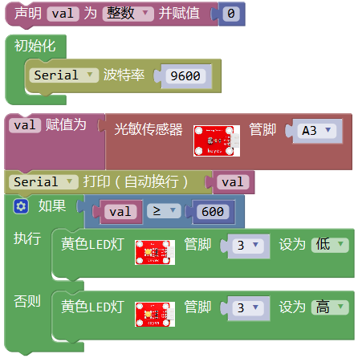

代码说明

1\. 在实验中，我们需要在库文件的单元内，找到以下元件。

2\.
其他设置变量，控制设置，以及串口通信，我们都在前面课程中介绍了。可以参考第四章节的实验三和实验五。

测试结果

上传测试代码成功，利用USB线上电后，打开串口监视器，设置波特率为9600。串口监视器显示对应模拟值。实验中，我们把光敏电阻传感器用手握住，数据变小，小于600时，LED模块上LED亮起，否则熄灭。

## 实验三 旋转编码器模块控制2个灯

实验说明

在前面课程的实验七中，我们利用旋转编码器计数。在这里我们将它扩展下，通过得出的计数，我们用来控制2个LED模块上LED的亮灭。

设计代码时，我们需要对所得数据取绝对值。然后我们将数据除以二，得到余数，余数为0控制一个模块上LED亮，余数为1，另一个模块上LED亮。

实验器材

keyes brick 旋转编码器模块\*1

keyes UNO PLUS开发板\*1

keyes brick LED模块\*2

传感器扩展板\*1

5P双头XH2.54连接线\*1

3P 双头XH2.54连接线\*2

USB线\*1

接线图

测试代码

代码说明

1.  在实验中，我们我们在找到，然后改为，

    即可设计对i取绝对值。

2.  在实验中我们我们在找到
    ，将+改成%，设置

    ，即将val1设置为val除以2的余数。

测试结果

上传测试代码成功，按照接线图接好线，上电后，旋转编码器，即可控制外接的2个LED模块上的LED的亮灭。

## 实验四 按键控制RGB灯

实验说明

在前面课程中，我们利用旋转编码器计数然后控制两个LED灯。在这一课程中，我们做一个扩展，我们利用代码，计算出按下模块上按键的次数。然后我们将所得数据除以三，所得余数为0 1 2三种。然后通过不同的余数，控制RGB模块上LED显示不同的颜色。

这样，我们就可以通过不断的按下按键，任意调节RGB模块上LED显示不同颜色了（三种颜色）。

实验器材

keyes brick 插件RGB模块\*1

keyes UNO PLUS开发板\*1

keyes brick 按键传感器\*1

传感器扩展板\*1

4P双头XH2.54连接线\*1

3P 双头XH2.54连接线\*1

USB线\*1

接线图

测试代码

代码说明

1.；手按下一次传感器上按键后，和数据变为不相等；
检测到一次为0，就会加1一次。

2.当我们没有按下按键时，和数据都为1，按下按键次数不变，按键次数除以3的余数不变，RGB模块上LED显示的颜色也就不变。

3.当我们长按按键时，和数据都为0，按下按键次数

不变，按键次数除以3的余数不变，RGB模块上LED显示的颜色也就不变。

4.当我们按下一次按键（按下后松开）时，为0，为1，按下按键次数加1，按键次数除以3的余数变化，RGB模块上LED显示的颜色改变一次。

测试结果

上传测试代码成功，按照接线图接好线，利用USB上电后，打开串口监视器，设置波特率为9600；串口监视器显示数据，不断按下按键，数据在0 1
2中变化。当为0时，RGB模块上LED显示红色；当为1时，RGB模块上LED显示绿色；当为2时，RGB模块上LED显示蓝色。

## 实验五 温度控制RGB灯

实验说明

在前面课程中，我们利用按键手动控制RGB模块上LED灯的颜色。在这一课程中，我们利用一个LM35温度传感器检测当前环境的温度。然后利用检测到的温度数据控制RGB模块上LED灯的颜色。

生活中，我们可以把这个电路设计应用到水杯中。我们利用温度传感器检测到水杯温度，控制水杯上LED的颜色。这样我们就可以通过LED颜色，判断水的大概温度。

实验器材

keyes brick 插件RGB模块\*1

keyes UNO PLUS开发板\*1

keyes brick LM35温度传感器\*1

传感器扩展板\*1

4P双头XH2.54连接线\*1

3P 双头XH2.54连接线\*1

USB线\*1

接线图

测试代码

代码说明

1.实验中，检测并显示温度的方法和上一课中实验二十一一样。

2.检测到温度数据后通过设置控制RGB模块上的LED颜色，设置方法参考上一课中实验五知识点。

测试结果

上传测试代码成功，按照接线图接好线，利用USB上电后，打开串口监视器，设置波特率为9600；串口监视器显示当前环境中温度数值。当温度小于等于25℃时，RGB模块上的LED显示红色；当温度大于25℃且小于等于30℃时，RGB模块上的LED显示绿色；当温度大于30℃时，RGB模块上的LED显示蓝色。

## 实验六 障碍物报警实验

实验说明

在上一课实验十一中，我们利用避障传感器检测前方障碍物，结果在串口监视器显示。在这一实验中，我们利用检测结果控制一个有源蜂鸣器响起。

生活中，我们可以利用一个检测传感器控制一个有源蜂鸣器响起，做报警设备，如检测磁场（霍尔传感器）、检测倾斜（倾斜模块）等等。

实验器材

keyes brick 避障传感器\*1

keyes UNO PLUS开发板\*1

keyes brick 有源蜂鸣器模块\*1

传感器扩展板\*1

3P 双头XH2.54连接线\*2

USB线\*1

接线图

测试代码

代码说明

1.实验中代码设置和上一课中实验十一类似，只是将控制串口监视器显示换成了控制有源蜂鸣器的响起。

测试结果

上传测试代码成功，按照接线图接好线，上电后，检测到障碍物时，外接的有源蜂鸣器响起声音，否则有源蜂鸣器停止响起声音。

# 相关资料链接地址

XXXXXXXXXXXXXXXXXXXXXXXXXXXXXXXXXX

提取码：XXX

米思齐软件下载地址

<http://mixly.org/explore/software/mixly-arduino>

