# 产品清单

|编码|名称|规格型号|数量|图片|
|-|-|-|-|-|
|1|Keyes模块|keyes brick LED红发红模块(焊盘孔) 防反插白色端子|1|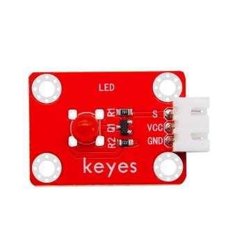|
|2|Keyes模块|keyes brick 插件RGB模块(焊盘孔) 防反插白色端子|1||
|3|Keyes传感器|keyes brick 热敏电阻传感器(焊盘孔) 防反插白色端子|1|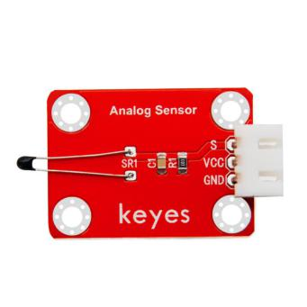|
|4|Keyes模块|keyes brick 无源蜂鸣器模块(焊盘孔) 防反插白色端子|1||
|5|keyes传感器|keyes brick 霍尔传感器(焊盘孔) 防反插白色端子|1|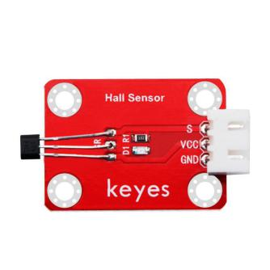|
|6|Keyes传感器|keyes brick 敲击模块传感器(焊盘孔) 防反插白色端子|1||
|7|Keyes模块|keyes brick 旋转编码器模块(焊盘孔) 防反插白色端子|1||
|8|keyes传感器|keyes brick 18B20温度传感器(焊盘孔) 防反插白色端子|1||
|9|Keyes模块|keyes brick LED黄发黄模块(焊盘孔) 防反插白色端子|1||
|10|Keyes传感器|keyes brick 光敏电阻传感器(焊盘孔) 防反插白色端子|1||
|11|Keyes模块|keyes brick 可调电位器模块(焊盘孔) 防反插白色端子|1|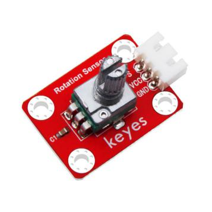|
|12|Keyes传感器|keyes brick 避障传感器(焊盘孔) 防反插白色端子|1||
|13|Keyes传感器|keyes brick 按键传感器(焊盘孔) 防反插白色端子（配黄帽）|1|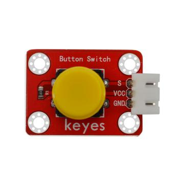|
|14|Keyes模块|keyes brick 干簧管(焊盘孔) 防反插白色端子|1||
|15|Keyes传感器|keyes brick DHT11温湿度传感器(焊盘孔) 防反插白色端子|1|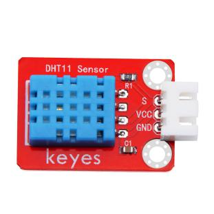|
|16|Keyes模块|keyes brick 激光头传感器模块(焊盘孔) 防反插白色端子|1||
|17|Keyes模块|keyes brick 3W LED模块(焊盘孔) 防反插白色端子|1||
|18|Keyes传感器|keyes brick 麦克风声音传感器(焊盘孔) 防反插白色端子|1||
|19|Keyes模块|keyes brick 有源蜂鸣器模块焊盘孔) 防反插白色端子|1||
|20|Keyes传感器|keyes brick 巡线传感器(焊盘孔) 防反插白色端子|1|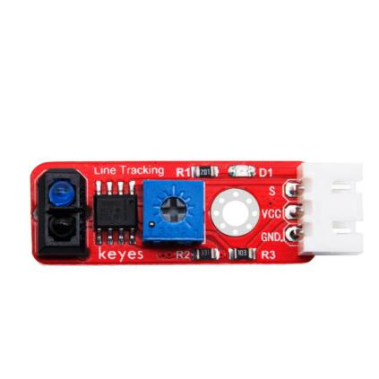|
|21|Keyes传感器|keyes brick 倾斜模块传感器(焊盘孔) 防反插白色端子|1|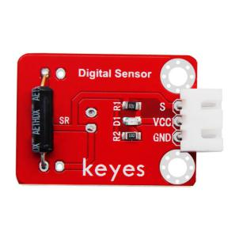|
|22|Keyes传感器|keyes brick 碰撞传感器(焊盘孔) 防反插白色端子|1||
|23|Keyes传感器|keyes brick LM35温度传感器(焊盘孔) 防反插白色端子|1||
|24|Keyes模块|keyes brick 5V 单路继电器模块(焊盘孔) 防反插白色端子|1||
|25|Keyes开发板|Keyes Uno Plus 开发板 红色环保|1|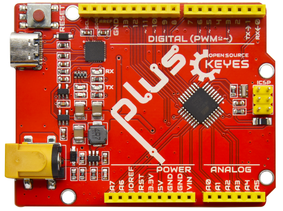|
|26|Keyes扩展板|Keyes brick shield 传感器扩展板 防反插白色端子|1||
|27|连接线|3P 双头XH2.54插头 L=200mm 白色|10|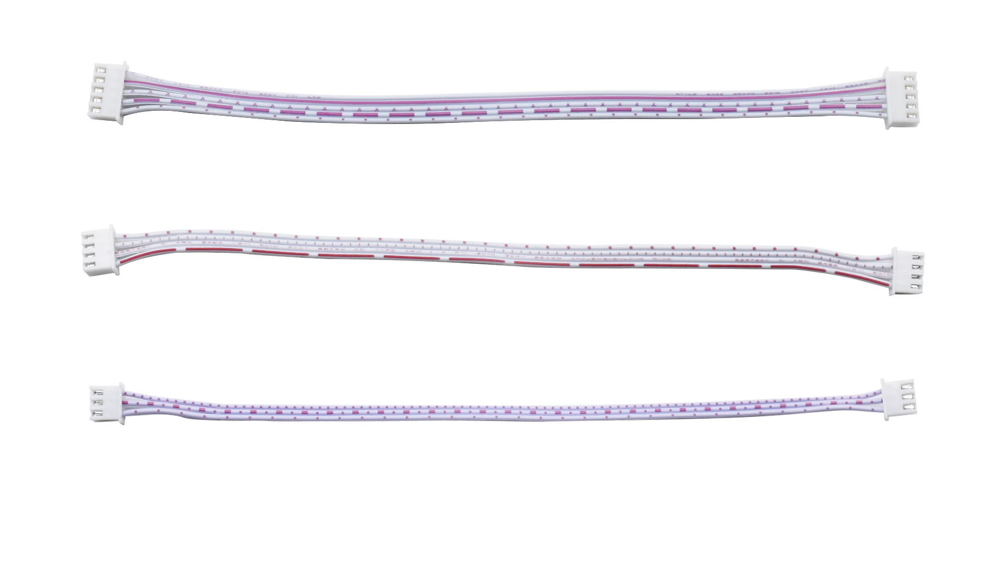<×10|
|28|连接线|4P 双头XH2.54插头 L=200mm 白色|2|<×2|
|29|连接线|5P 双头XH2.54插头 L=200mm 白色|2|<×2|
|30|USB线|USB2.0对TYPE C 白色 L:1M OD：4.0MM|1|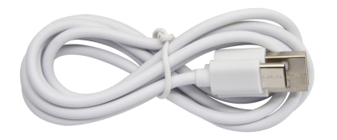|
